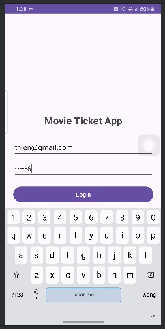

# Movie Ticket App - Android Project

Ứng dụng đặt vé xem phim sử dụng Firebase (Auth, Firestore, Messaging).

## Chức năng chính
- **Login/Register**: Xác thực người dùng qua Firebase Auth.
- **Danh sách phim**: Hiển thị danh sách phim đang chiếu từ Firestore.
- **Chi tiết phim**: Xem thông tin chi tiết và trailer phim.
- **Đặt vé**: Chọn suất chiếu và vị trí ghế ngồi theo thời gian thực.
- **Thông báo**: Nhận thông báo nhắc lịch chiếu và xác nhận đặt vé qua FCM.

## Ảnh giao diện
| Đăng nhập | Danh sách phim | Chi tiết phim |
|:---:|:---:|:---:|
|  |  |  |

| Chọn ghế | Thông báo |
|:---:|:---:|
|  |  |

## Công nghệ sử dụng
- **Ngôn ngữ**: Java
- **Database**: Google Firebase Firestore
- **Authentication**: Firebase Auth
- **Push Notification**: Firebase Cloud Messaging (FCM)
- **Image Loading**: Glide Library

## Cài đặt
1. Clone project.
2. Cấu hình file `google-services.json` từ Firebase Console vào thư mục `app/`.
3. Mở bằng Android Studio và Run.
4. Nhấn nút **"Demo Data"** ở màn hình chính để khởi tạo dữ liệu phim và suất chiếu nếu database trống.
