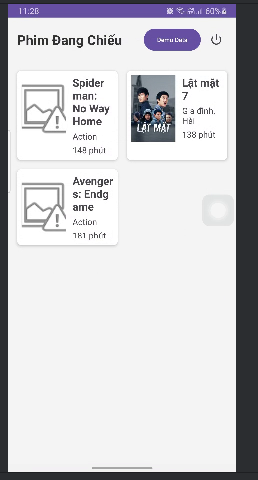
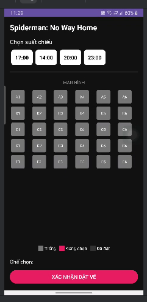
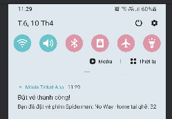
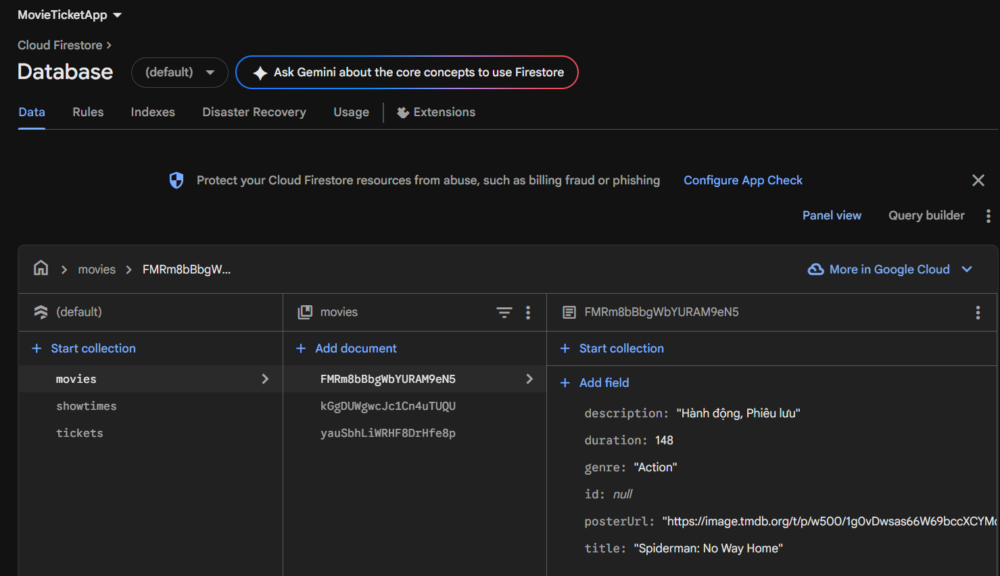

# 🎬 Movie Ticket App - Android Project

Ứng dụng đặt vé xem phim sử dụng hệ sinh thái Firebase (Auth, Firestore, FCM), hỗ trợ người dùng trải nghiệm luồng đặt vé chuyên nghiệp ngay trên thiết bị di động.

## 🚀 Chức năng chính
- **Xác thực người dùng**: Đăng ký và đăng nhập bảo mật qua **Firebase Authentication**.
- **Danh sách phim**: Hiển thị các phim đang chiếu với hình ảnh poster sống động (sử dụng thư viện **Glide**).
- **Đặt vé & Chọn ghế**:
    - Hiển thị danh sách suất chiếu linh hoạt cho từng phim.
    - Sơ đồ chọn ghế ngồi trực quan, hỗ trợ kiểm tra ghế đã đặt (Occupied) theo thời gian thực.
    - Lưu thông tin vé vào **Firestore** sau khi giao dịch thành công.
- **Push Notification**:
    - Nhận thông báo xác nhận đặt vé tức thì (Local Notification).
    - Sẵn sàng nhận nhắc lịch chiếu phim qua **Firebase Cloud Messaging (FCM)**.

## 📸 Hình ảnh minh họa dự án

### 1. Đăng nhập & Truy cập hệ thống
Giao diện đăng nhập đơn giản, bảo mật kết nối trực tiếp với Firebase Auth.

### 2. Danh sách phim đang chiếu
Phim được hiển thị theo dạng lưới (Grid), tự động cập nhật từ cơ sở dữ liệu.

### 3. Quy trình Đặt vé & Chọn ghế
Người dùng dễ dàng chọn suất chiếu và vị trí ghế mong muốn. Các ghế đã có người ngồi sẽ bị vô hiệu hóa.

### 4. Thông báo xác nhận đặt vé
Ngay sau khi đặt thành công, một thông báo sẽ được gửi tới thanh trạng thái để nhắc người dùng về lịch phim.

### 5. Quản lý dữ liệu trên Firebase Console
Toàn bộ dữ liệu về phim, suất chiếu và vé đặt được quản lý tập trung và đồng bộ trên Cloud Firestore.

## 🛠 Công nghệ & Thư viện
- **Ngôn ngữ**: Java
- **Database**: Cloud Firestore
- **Auth**: Firebase Authentication
- **Push Notification**: FCM & NotificationManager
- **Image Loader**: Glide

## 📝 Hướng dẫn khởi tạo
1. Chạy ứng dụng trên máy thật hoặc máy ảo.
2. Tại màn hình chính, nhấn nút **"Demo Data"** để hệ thống tự động khởi tạo danh sách phim và suất chiếu lên Firebase của bạn (nếu database đang trống).
3. Tiến hành đăng nhập và đặt vé để trải nghiệm toàn bộ luồng chức năng.
